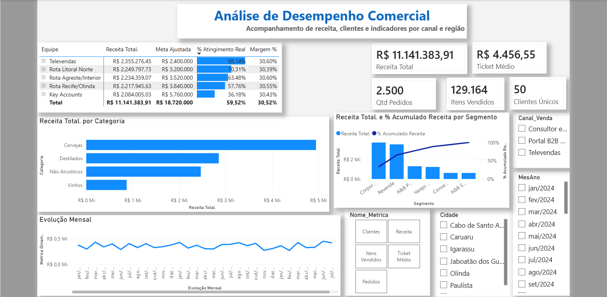

# 📊 Dashboard Executivo de Desempenho Comercial | Power BI

Este repositório contém um projeto completo de Business Intelligence desenvolvido no **Power BI**, focado na análise de dados comerciais, acompanhamento de KPIs, comportamento de vendas por canal, segmento e evolução temporal.
## 🖼️ Demonstração do Painel


---

## 🎯 Objetivo do Projeto

O objetivo principal deste dashboard é fornecer uma visão estratégica e intuitiva do desempenho de vendas, permitindo que gestores analisem a receita, quantidade de pedidos, volume de itens vendidos e base ativa de clientes sob diferentes perspectivas (geográfica, canal de venda e linhas de produtos).

---

## 🛠️ Tecnologias e Ferramentas Utilizadas

* **Power BI Desktop:** Construção das visões, modelagem de dados e layout.
* **DAX (Data Analysis Expressions):** Criação de métricas de negócio, agregações e lógica de métrica dinâmica.
* **Power Query:** Tratamento, limpeza e transformação da base de dados.
* **Modelagem de Dados:** Esquema em estrela (*Star Schema*) interligando tabelas fato (`fVendas`) e dimensões (`dCalendario`, `dClientes`, `dProdutos`, etc.).

---

## 📈 Principais Indicadores e Recursos

### 🔹 Indicadores de Topo (KPIs)
* **Receita Total:** Faturamento acumulado do período.
* **Clientes Únicos:** Contagem distinta de compradores (`DISTINCTCOUNT`).
* **Qtd Pedidos:** Volume total de transações efetuadas.
* **Itens Vendidos:** Total de unidades comercializadas.
* **Ticket Médio:** Valor médio gasto por pedido.

### 🔹 Recursos e Funcionalidades
* **Métrica Dinâmica:** Seleção interativa para alternar a visão do gráfico temporal de linhas entre *Receita*, *Pedidos*, *Clientes*, *Ticket Médio* e *Itens Vendidos*.
* **Análise por Categoria e Segmento:** Visão Pareto e gráficos de barras para identificação dos produtos e públicos com maior representatividade.
* **Filtros Temporais e Geográficos:** Segmentação por Ano, Mês/Ano, Cidade e Canal de Venda.
* **Interações Personalizadas:** Configuração precisa de interações entre visuais, mantendo o gráfico de linhas com histórico contínuo enquanto os cartões e tabelas reagem aos filtros pontuais.

---

## 📐 Fórmulas DAX Utilizadas

```dax
// ==========================================
// 1. INDICADORES PRINCIPAIS (KPIs)
// ==========================================

// Receita acumulada
Receita Total = SUM(fVendas[Valor_Total])

// Contagem distinta de clientes ativos
Clientes Únicos = DISTINCTCOUNT(fVendas[ID_Cliente])

// Volume total de pedidos
Qtd Pedidos = DISTINCTCOUNT(fVendas[ID_Pedido])

// Total de itens/unidades vendidas
Itens Vendidos = SUM(fVendas[Quantidade])

// Valor médio por pedido
Ticket Médio = DIVIDE([Receita Total], [Qtd Pedidos], 0)


// ==========================================
// 2. MÉTRICA DINÂMICA (GRÁFICO TEMPORAL)
// ==========================================

Metrica Selecionada = 
SWITCH(
    SELECTEDVALUE(dMetricas[Ordem]),
    1, [Receita Total],
    2, [Itens Vendidos],
    3, [Clientes Únicos],
    4, [Ticket Médio],
    5, [Qtd Pedidos],
    [Receita Total]
)


// ==========================================
// 3. TÍTULO DINÂMICO DO GRÁFICO
// ==========================================

Titulo Evolucao Mensal = 
"Evolução Mensal - " & SELECTEDVALUE(dMetricas[Nome_Metrica], "Receita Total")


// ==========================================
// 4. ANÁLISE DE PARETO / REPRESENTATIVIDADE
// ==========================================

% Acumulado Receita = 
VAR ReceitaTotalGeral = CALCULATE([Receita Total], ALLSELECTED(fVendas))
VAR ReceitaAtual = [Receita Total]
RETURN
DIVIDE(ReceitaAtual, ReceitaTotalGeral, 0)
